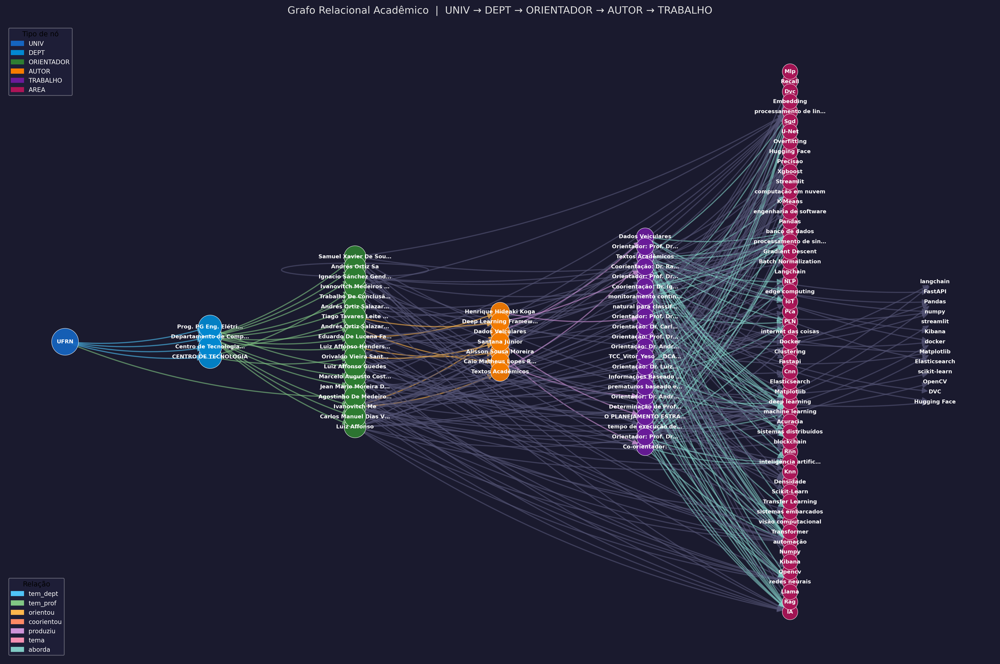

# 📊 Projeto: Análise dos Textos do CT UFRN

Projeto desenvolvido para a disciplina de **Algoritmos e Estruturas de Dados II**, com o objetivo de aplicar conceitos de **processamento de dados, NLP e grafos** na análise de Trabalhos de Conclusão de Curso (TCC).

---

## 👨‍💻 Integrantes

* José Felix Rodrigues Anselmo
* Lucas Henrique Alves de Queiroz
* Carlos Eduardo Nascimento Morais

---

## 🎯 Objetivo

Analisar os Trabalhos de Conclusão de Curso (TCCs) do **Centro de Tecnologia (CT) da UFRN**, referentes ao período de **Janeiro de 2025**, realizando:

* Extração de textos de arquivos `.pdf`
* Limpeza e normalização dos dados
* Aplicação de técnicas de **Processamento de Linguagem Natural (PLN)**
* Construção de **grafos de co-ocorrência**
* Geração de **visualizações gráficas e interativas**

---

## 📂 Estrutura do Projeto

```
Projeto_NER/
│
├── main.py
├── preprocessamento.py
├── extract_pdf.py
├── create_grafo.py
├── grafo_orientadores.py
├── visualizar_grafo.py
│
├── TCC/
├── output/
├── figuras/
│
├── requirements.txt
└── README.md
```

---

## ⚙️ Instalação

### Criar ambiente virtual

```bash
python -m venv .venv
source .venv/bin/activate  # Linux
```

### Instalar dependências

```bash
pip install -r requirements.txt
```

### Instalar modelos spaCy

```bash
python -m spacy download pt_core_news_sm
python -m spacy download pt_core_news_lg
```

---

## ▶️ Execução

```bash
python main.py
```

---

## 🔄 Metodologia

1. Coleta de TCCs (PDF)
2. Extração de texto (PyMuPDF)
3. Limpeza com Regex
4. Aplicação de NER (spaCy + BERT + manual)
5. Construção de grafos
6. Análise de métricas
7. Visualização dos resultados

---

## 📊 Resultados

O sistema gera:

* Grafos de co-ocorrência
* Grafos relacionais
* Distribuição de grau
* Ego-grafos
* Visualizações interativas (HTML)

### 🖼️ Exemplos de Saída

#### 🔗 Grafo Relacional
[Grafo Relacional Orientadores ](grafo_orientadores.html)


#### 🌐 Grafo de Co-ocorrência
Este grafo representa uma rede de co-ocorrência construída a partir dos textos dos TCCs. Cada nó representa uma entidade extraída via NER, e as arestas indicam que essas entidades aparecem juntas em um mesmo contexto, como uma sentença ou parágrafo.

- [Grafo de Co-ocorrência](/figuras/ego_precisão.html)
  


## 📊 Distribuição de Grau

#### K500 chars


#### Senteças 


#### Paragrafo


#### 🎯 Ego-Grafo de alguns contextos 

- [Termo Precisão](/figuras/ego_precisão.html)


  

> ⚠️ Os arquivos acima são gerados automaticamente na pasta `figuras/` após a execução do projeto.

---

## 🧠 Tecnologias

* Python
* spaCy
* Transformers
* NetworkX
* Matplotlib
* Pyvis
* PyMuPDF

---

## 📚 Referências

* [https://pymupdf.readthedocs.io/en/latest/](https://pymupdf.readthedocs.io/en/latest/)
* [https://docs.python.org/3/library/re.html](https://docs.python.org/3/library/re.html)
* [https://pyvis.readthedocs.io/en/latest/](https://pyvis.readthedocs.io/en/latest/)
* [https://spacy.io/](https://spacy.io/)
* [https://matplotlib.org/](https://matplotlib.org/)
* [https://networkx.org/](https://networkx.org/)

---

## 🎥 Vídeo

Devido a problemas técnicos não conseguimos anexar o vídeo a plataforma Loom.Por isso postamos o vídeo no YouTube.

Link: https://youtu.be/u6Ta7qVVxqs

---

## 📌 Conclusão

O projeto integra **PLN + Grafos**, permitindo analisar relações em textos acadêmicos de forma visual e estruturada Co-ocorrência. Além disso é possível destacar que os temas dentro desse período em sua maioria foram relacionados a inteligência artifical, podemos vê isso no destaque do ego gráfico que destacar com o maior numero de relações o nó `Precisão`.